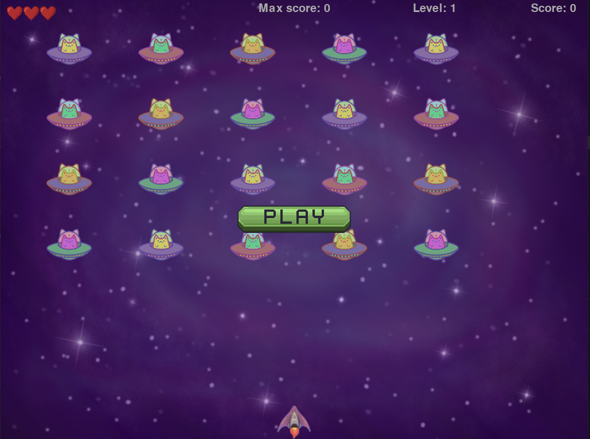

# Cats-Invasion

### Игра по книге "Eric Matthews Python Crash Course"



## Как запустить?
### Клонируем репозиторий:
```
$ git clone https://github.com/pelkoa-glitch/Cats-Invasion.git
```
### Устанавливаем зависимости:
```
$ cd Cats-Invasion

$ pip install -r requirements.txt
```
### Запускаем:
```
$ python cats_invasions.py
```

## Управление:
```
Начать игру: кликнуть мышной по кнопке "Play"

Стрельба: пробел

Закрыть приложение: кнопка "q" на клавиатуре
```
